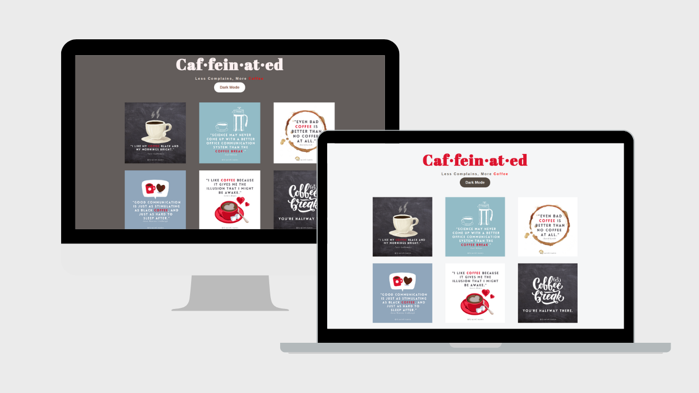

# Coffee Quote Minsite
[**Demo**](https://www.example.com)

---
## **Project Overview:**
- A minisite using HTML, CSS, JAVASCRIPT
- Create a Image Gallery using **Flexbox** to structure the elements
- **Dark Mode** Toggle (CSS + Javascript)
- Clickable Images (see below) (CSS + Javascript)

## **Clickable** Images
- Make **clickable image** and Enlarge it on click using CSS+Jacascript
    - Add a class of "gallery-img" to each of your images.
    - Wrap your images in an anchor tag with a class of "gallery-link" and a data attribute "data-image" that points to the path of the larger version of the image.
    - Style the anchor tags in the css styleshee and make anchor tags and images display inline and remove the default underline from anchor tags.
    - Add to the Javascript page **forEach() and addEventListener()** functions to 1) handle the click event on the anchor tags and 2) display the larger version of the image in a modal dialog: 
    - **forEach()** is a method used to execute a function on each element in an array, while add
    - **EventListener()** is a method used to attach an event handler to the specified element.
    - Finally, style the modal dialog in the CSS stylesheet.

## **Design Tools:**
- Design tool [canva](https://www.canva.com)
- Font Tool: [Google Fonts](https://fonts.google.com/)
